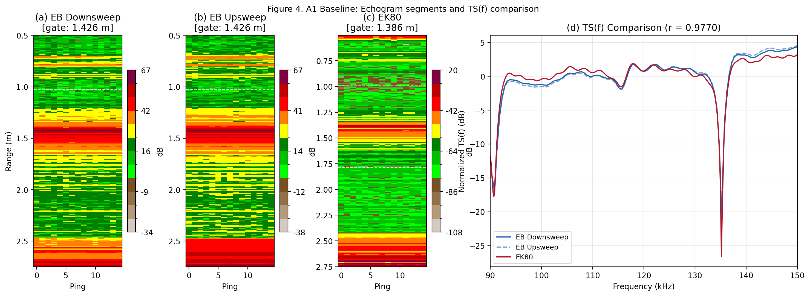
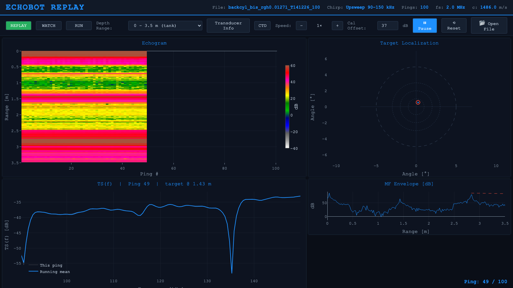
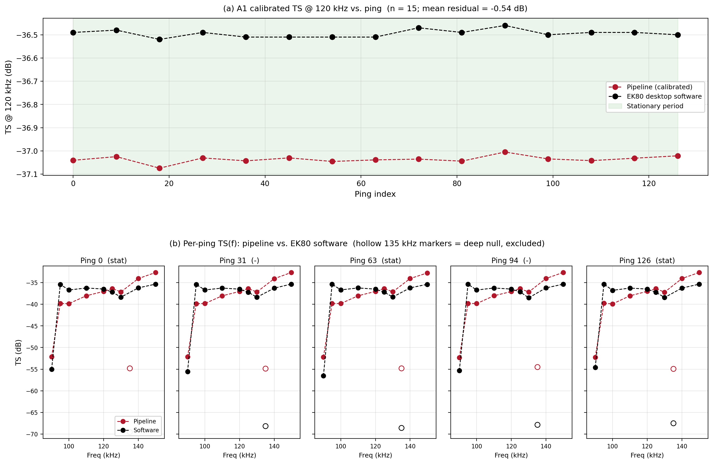
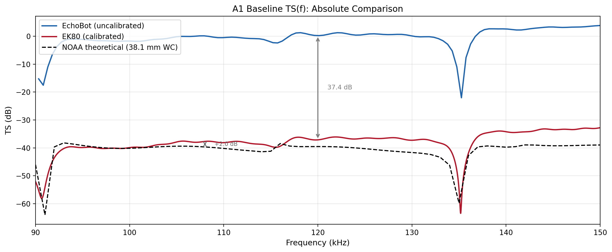

# echobot

**Signal-processing and calibration code for the MIT/WHOI EchoBot broadband echosounder.**

This repository is the frozen reference implementation accompanying the manuscript on broadband target-strength characterization of a low-cost, low-power echosounder designed for autonomous oceanographic platforms. It contains the end-to-end Python pipelines that take raw EchoBot `.mat` and Simrad EK80 `.raw` files through to uncalibrated TS(f) (EchoBot) and absolute calibrated TS(f) (EK80), plus the cross-instrument comparison, SNR analyses, linearity diagnostics, calibration-validation routines, and all supporting documentation.



*A1 baseline: matched-filter envelope versus range (left) and normalized TS(f) spectral shape overlay (right) for EchoBot and EK80. Cross-instrument Pearson r = 0.984 over the 100–140 kHz overlap band.*

---

## What's in here

| Directory | Contents |
|---|---|
| [`echobot/`](echobot/) | The Python package — see [module overview](#package-modules) below |
| [`notebooks/`](notebooks/) | Two Jupyter notebooks: a pedagogical `01_pipeline_demo` and a reproduction-of-manuscript-figures `02_manuscript_analysis` |
| [`scripts/`](scripts/) | CLI wrappers around the notebooks for headless use |
| [`docs/`](docs/) | Pipeline provenance, sonar-equation parameter reference, data layout |
| [`data/`](data/) | Small reference assets (NOAA sphere TS(f), EK80 software validation CSVs); raw data is hosted externally — see [`docs/DATA.md`](docs/DATA.md) |
| [`tests/`](tests/) | Synthetic-data smoke tests runnable without the large raw archive |
| [`replay_app/`](replay_app/) | Browser-based replay interface for EchoBot `.mat` data files — see [Replay App](#replay-app) below |

## Replay App

An interactive browser-based replay interface for visualizing EchoBot data files in real time. Replays `.mat` recordings with the same matched-filter processing used in the analysis pipeline, displaying a live echogram, split-beam target localization, TS(f) spectra, and matched-filter envelope.



**Features:**
- **Echogram** (EK500 colormap) — depth × ping heatmap that fills sequentially during replay, with selectable depth range
- **Target localization** — split-beam phase-difference angles with history overlay and concentric beam-pattern rings
- **TS(f)** — per-ping and running-mean target-strength spectra (90–150 kHz), with adjustable calibration offset (default +37 dB electronics gain)
- **MF envelope** — matched-filter amplitude vs range with 1/r² theoretical decay reference
- **Mode selector** — REPLAY / WATCH / RUN modes; file browser for selecting recordings
- **Transducer info** — displays connected transducer parameters, chirp configuration, and acquisition settings
- **CTD import** — load environmental profiles (temperature, salinity, sound speed) from CSV

**Run it:**

```bash
cd replay_app
pip install flask scipy numpy
python app.py
```

Then open http://localhost:5050 in a browser. The app loads the default CRL test file and begins replaying automatically.

## Installation

Requires Python ≥ 3.10.

```bash
git clone https://github.com/emmettFC/echobot.git
cd echobot
pip install -e .
```

For notebook use, install with the `dev` extras:

```bash
pip install -e ".[dev]"
```

The package depends on `numpy`, `scipy`, `pandas`, `matplotlib`, `xarray`, `echopype`, and `openpyxl`. See [`pyproject.toml`](pyproject.toml) for exact version floors.

## Quickstart

Process an EchoBot A1 baseline file and overlay it against the EK80 equivalent:

```python
from echobot import io, echobot_pipeline, ek80_pipeline, compare, plotting

# EchoBot: load + process
eb_run  = io.load_echobot_mat("data/echobot/0311-CRL-tests/backcyl_bis_rgh0.01271_T115300_100.mat")
eb_proc = echobot_pipeline.process_echobot_run(eb_run)

# EK80: load + process (pulse compression + full sonar equation)
ed      = io.open_ek80_raw("data/EK80/0311-CRL-tests/prod-D20260311-T182413.raw")
ek_proc = ek80_pipeline.process_ek80_ed(ed)

# Cross-instrument Pearson correlation on the 100–140 kHz overlap band
res = compare.cross_instrument_r(
    eb_proc.tsf_db, eb_proc.f_hz,
    ek_proc.tsf_calibrated_db, ek_proc.f_band_sorted,
)
print(f"Cross-instrument r = {res.pearson_r:.4f}")

# Plot
plotting.plot_tsf_overlay(
    eb_proc.f_hz, eb_proc.tsf_db,
    ek_proc.f_band_sorted, ek_proc.tsf_calibrated_db,
)
```

On the A1 baseline this prints `Cross-instrument r = 0.9842` and reproduces the spectral-shape overlay above.

## Package modules

All processing lives under [`echobot/`](echobot/). Each module is importable as `from echobot import <name>`.

| Module | Purpose |
|---|---|
| [`config`](echobot/config.py) | Physical and processing constants (sound speed, absorption, impedance, gate width, FFT length). Every constant is documented with provenance. |
| [`io`](echobot/io.py) | Loaders for EchoBot `.mat`, Simrad EK80 `.raw` (via echopype), and SoundTrap `.wav` files, plus timestamp parsing and file indexing. |
| [`echobot_pipeline`](echobot/echobot_pipeline.py) | EchoBot signal processing: bandpass → matched filter → range gate → Hanning → coherent FFT → `|TX|²` deconvolution → uncalibrated TS(f). Implements Section 2.4 of the manuscript. |
| [`ek80_pipeline`](echobot/ek80_pipeline.py) | EK80 signal processing: chirp reconstruction → WBT/PC filter chain → pulse compression → aliasing-aware frequency mapping → absolute calibrated TS(f) via the full sonar equation (`compute_absolute_tsf`). Implements Section 2.5 of the manuscript and mirrors echopype's internal `_cal_complex_samples`. |
| [`snr`](echobot/snr.py) | Two SNR methods: `snr_no_target_ref` (dedicated no-target reference run) and `snr_empty_region` (within-ping empty-water-column reference, 2.1–2.6 m). |
| [`compare`](echobot/compare.py) | Cross-instrument TS(f) normalization and Pearson correlation. Used for Tables 3 and S1 and Figures 4, 5 of the manuscript. |
| [`linearity`](echobot/linearity.py) | Power/pulse-duration/bandwidth linearity diagnostics. Used for Figure 6. The bandwidth comparison uses the 100–140 kHz overlap band for normalization. |
| [`hydrophone`](echobot/hydrophone.py) | SoundTrap hydrophone processing for both passive monitoring (Figure S1) and hydrophone-as-target runs (Figure S2), including the linear dB ↔ Watt receive-level mapping used to cross-check the EchoBot source level against the calibrated EK80 absolute scale. |
| [`plotting`](echobot/plotting.py) | Shared plotting helpers: EK500 colormap, TS(f) overlays, SNR histograms, and the supplementary calibration figures (S10, S11). |

## Reproducing the manuscript figures

[`notebooks/02_manuscript_analysis.ipynb`](notebooks/02_manuscript_analysis.ipynb) runs the full nine-group analysis from raw data and writes every main-text and supplementary figure to `output/figures/`. A CLI wrapper is provided as [`scripts/generate_manuscript_figures.py`](scripts/generate_manuscript_figures.py):

```bash
python scripts/generate_manuscript_figures.py \
    --echobot-dir data/echobot/0311-CRL-tests \
    --ek80-dir    data/EK80/0311-CRL-tests \
    --output-dir  output/figures
```

The smaller [`notebooks/01_pipeline_demo.ipynb`](notebooks/01_pipeline_demo.ipynb) walks through the EchoBot and EK80 pipelines on a single A1 baseline ping and produces the quickstart plot above.

## EK80 calibration validation

The `compute_absolute_tsf` function has been independently validated against the Simrad EK80 desktop software by manually reading TS values for the same A1 baseline recording (127 pings) at (a) 120 kHz across 15 pings and (b) 10 discrete frequencies spanning 90–150 kHz across 5 pings. Full results are in [`docs/PIPELINE.md`](docs/PIPELINE.md) and reproduced by [`scripts/validate_ek80_vs_software.py`](scripts/validate_ek80_vs_software.py).



**Summary:**
- Mean residual at 120 kHz across 15 pings: **−0.54 dB** (std 0.013 dB)
- Mean residual across 5 pings × 9 non-null frequencies: **+0.02 dB** (std 2.56 dB)
- Arithmetic of every term in the sonar equation is documented and reproduced in [`docs/SONAR_EQUATION.md`](docs/SONAR_EQUATION.md)

## Absolute TS(f) comparison

With the validated EK80 calibration in hand, the uncalibrated EchoBot TS(f), the calibrated EK80 TS(f), and the NOAA theoretical reference for the 38.1 mm WC sphere can be directly compared:



The ~+37 dB offset between the uncalibrated EchoBot and the calibrated EK80 represents the unknown combined EchoBot transmit + receive electronics gain constant. The calibrated EK80 agrees with the NOAA theoretical curve to +2.4 dB at 120 kHz; the ~5 dB residual spectral tilt is attributed to the use of a single scalar gain (G = 18.0 dB) rather than a frequency-dependent G(f) curve. See [`docs/PIPELINE.md`](docs/PIPELINE.md) for the full breakdown.

## Data

Only small reference assets (NOAA sphere TS(f), EK80 software validation CSVs) are bundled in this repository. The full raw data archive — EchoBot `.mat`, EK80 `.raw`, SoundTrap `.wav`, and CTD `.nc` files — is ~10–15 GB and will be published on Zenodo. See [`docs/DATA.md`](docs/DATA.md) for the directory layout and the DOI (added here once the Zenodo record is minted).

## Tests

```bash
pip install -e ".[dev]"
pytest
```

The test suite runs without any raw data: it synthesizes EchoBot-style matched-filter output and exercises `bp_filter`, `tsf_from_mf`, `compute_absolute_tsf`, the SNR routines, the comparison helpers, and the linearity diagnostics against known analytical expectations.

## Citation

```bibtex
@article{echobot2026,
  author  = {Culhane, Emmett and [co-authors TBD]},
  title   = {Broadband target-strength characterization of a low-cost, low-power echosounder for autonomous oceanographic platforms},
  journal = {[TBD]},
  year    = {2026},
}
```

The code can additionally be cited via the Zenodo DOI for the software release (added here once minted).

## License

MIT — see [LICENSE](LICENSE).

## Authors

See [AUTHORS.md](AUTHORS.md).
